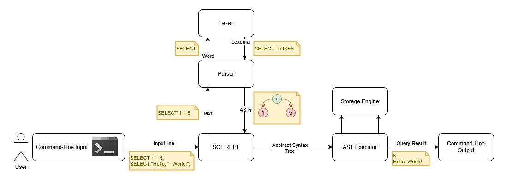

# Garlic



Garlic is an in-progress C++ database project with a custom SQL parser, AST, and REPL-style execution loop.

## Status

This project is in **active development**. Core components are evolving.

## What Works Today

- SQL parsing for `SELECT`-only workflows (expressions and conditions).
- Arithmetic, comparison, and logical operators in parser/AST flow.
- String literals and escaping in parser pipeline.
- Error reporting with stage tags (`LEXICAL`, `SYNTAX`, `SEMANTIC`).
- Interactive/file-style output mode switching for location formatting.

## Build

```bash
./scripts/build.sh
```

## Run

```bash
./scripts/run.sh
```

## Test

Run all tests through CTest:

```bash
./scripts/test.sh
```

Test set currently includes:

- unit tests
- SQL parser integration tests
